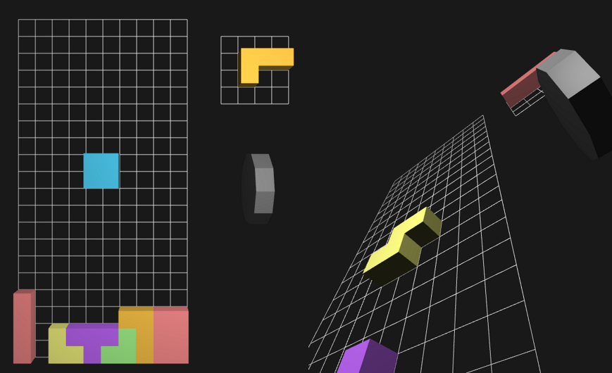

# 3D Tetris



Whoa! It's 3D!

## CLONING

This project uses a Git submodule to one of my helper libraries, so please clone
via:

```bash
git clone --recursive-submodules https://github.com/fosskers/tetris
```

## COMPILATION

### On Arch

```bash
sudo pacman -S clang cmake glew glfw
cmake .
make
```

### On Ubuntu

```bash
sudo apt-get install libglfw3-dev libglew-dev clang cmake
cmake .
make
```

**Note:** `libglfw3-dev` is not available in Trusty's repositories. You can
either build it from source, grab it from Utopic's repos or install it from
Keith Winstein's PPA:

```bash
sudo add-apt-repository ppa:keithw/glfw3
```

## USAGE

LEFT  - Move the block left.

RIGHT - Move the block right.

DOWN  - Move the block down faster.

UP    - Spin the block.

R     - Reset the game.

C     - Reset the camera.

## CAMERA CONTROLS

Use WASD to fly through Camera Space. Your mouse changes the camera angle.

If things get crazy, press `c` to reset the camera.
